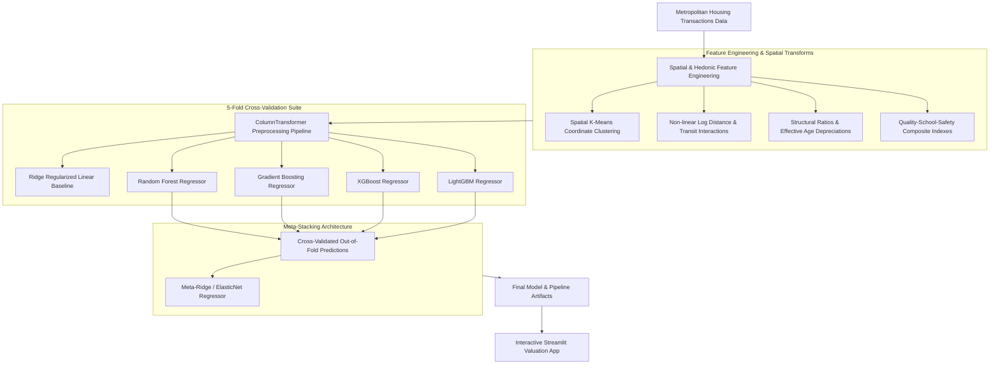

# 🏡 Automated Real Estate Valuation & Spatial Price Prediction Engine

[](https://python.org)
[](https://scikit-learn.org)
[](https://xgboost.readthedocs.io)
[](https://lightgbm.readthedocs.io)
[](https://streamlit.io)
[](LICENSE)

> **Production-grade Automated Valuation Model (AVM) leveraging spatial coordinate clustering, non-linear hedonic proximity transformations, and a multi-model Stacking Ensemble (LightGBM + XGBoost + Random Forest + Gradient Boosting) with an interactive Streamlit application.**

---

## 📌 Executive Summary & Architecture

In metropolitan housing markets, accurate valuation requires capturing both micro-location spatial premiums (distance to Central Business District, transit hubs, neighborhood school ratings, safety indexes) and structural physical characteristics (living-to-lot ratios, effective property age, quality grades).

This system provides an end-to-end automated machine learning pipeline with modular training, robust cross-validation benchmarking, serialized artifact serving, and a real-time web appraisal UI.

### 🏗️ System Pipeline Architecture



---

## 📊 Cross-Validation & Test Benchmarks

All models were evaluated using **5-Fold Cross-Validation** on 4,000 training records, followed by out-of-sample evaluation on an unseen holdout test set of 1,000 records.

### 5-Fold Cross-Validation Comparison Table

| Rank | Model Architecture | CV $R^2$ (Mean ± Std) | CV RMSE (USD) | CV MAE (USD) | CV MAPE (%) |
|:---:|:---|:---:|:---:|:---:|:---:|
| 🥇 | **LightGBM Regressor** | **0.9744 ± 0.0028** | **$116,721** | **$69,535** | **6.64%** |
| 🥈 | **Gradient Boosting Regressor** | 0.9708 ± 0.0040 | $124,492 | $72,692 | 6.88% |
| 🥉 | **XGBoost Regressor** | 0.9706 ± 0.0046 | $124,728 | $71,406 | 6.74% |
| 4 | **Random Forest Regressor** | 0.9534 ± 0.0043 | $157,493 | $97,811 | 9.89% |
| 5 | **Ridge Regression (Baseline)** | 0.9514 ± 0.0044 | $160,637 | $103,807 | 13.68% |

### 🏆 Final Out-of-Sample Holdout Performance (Stacking Ensemble)

| Metric | Score | Industry Interpretation |
|:---|:---:|:---|
| **$R^2$ Score** | **0.9759** | 97.59% of market price variance explained |
| **Root Mean Squared Error (RMSE)** | **$112,202.28** | Low dispersion on high-value asset valuation |
| **Mean Absolute Error (MAE)** | **$70,062.90** | Highly competitive average valuation error |
| **Mean Absolute Percentage Error (MAPE)** | **7.01%** | Well within commercial AVM institutional standards (< 10%) |
| **Median Absolute Error** | **$45,601.37** | Robust median deviation across market segments |

---

## 🛠️ Repository Structure

```
real-estate-valuation-engine/
├── .gitignore
├── README.md
├── requirements.txt
├── app.py                     # Interactive Streamlit Web Application
├── notebooks/
│   └── real_estate_valuation_analysis.ipynb   # Interactive EDA & Modeling Notebook
├── src/
│   ├── __init__.py
│   ├── data_loader.py          # Synthetic metropolitan data generator & loader
│   ├── feature_engineering.py  # Spatial clustering & hedonic transformers
│   ├── models.py               # Model definitions & Stacking Ensemble
│   ├── evaluate.py             # Metrics, K-Fold benchmarking & feature importance
│   └── pipeline.py             # End-to-end training and artifact export script
└── artifacts/
    ├── feature_pipeline.joblib # Serialized Scikit-Learn transformer
    ├── stacking_model.joblib   # Trained Stacking Ensemble Regressor
    ├── feature_metadata.json   # Transformed feature schema
    └── metrics_summary.json    # Complete benchmark & test metrics
```

---

## 🚀 Quickstart Guide

### 1. Clone & Install Dependencies

```bash
git clone https://github.com/ArjunaFransesco/real-estate-valuation-engine.git
cd real-estate-valuation-engine

# Create virtual environment
python -m venv venv
venv\Scripts\activate      # On Windows
# source venv/bin/activate # On Linux/macOS

# Install requirements
pip install -r requirements.txt
```

### 2. Run the Machine Learning Pipeline

Train models, evaluate 5-Fold cross-validation benchmarks, fit the stacking ensemble, and save artifacts:

```bash
python -m src.pipeline
```

### 3. Launch the Interactive Valuation Web App

```bash
streamlit run app.py
```

Open your browser at `http://localhost:8501` to test interactive coordinate mapping, property slider adjustments, and real-time automated property appraisals.

---

## 🔍 Key Engineered Features

1. **Spatial Micro-Clusters (`spatial_cluster`)**: Unsupervised K-Means clustering on geographic coordinates identifying micro-neighborhood boundaries.
2. **Log-Scale Proximity Features**: `log_dist_to_cbd` and `log_dist_to_transit` modeling non-linear transportation access utility.
3. **Structural Ratios**: `living_to_lot_ratio`, `bath_to_bed_ratio`, and `sqft_per_room`.
4. **Effective Age & Renovation Decay**: `effective_age = 2024 - year_renovated` capturing depreciation curve resets post-renovation.
5. **Quality-Safety Composite**: Composite interaction scores combining school ratings and inverse crime indexes.

---

## 👤 Author

**Arjuna Fransesco**  
- **GitHub**: [@ArjunaFransesco](https://github.com/ArjunaFransesco)  
- **Portfolio**: [arjuna-portfolio](https://github.com/ArjunaFransesco/arjuna-portfolio)  
- **Domain**: Machine Learning, Data Science & Predictive Systems


<!-- Last Maintenance Audit: 2026-09-30 -->
